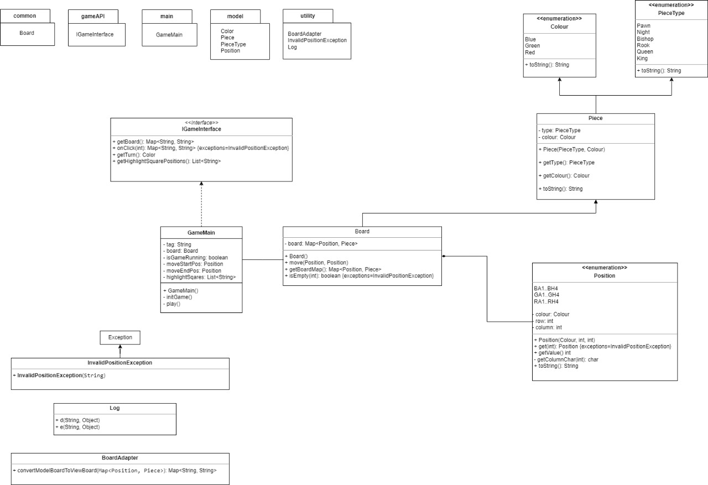
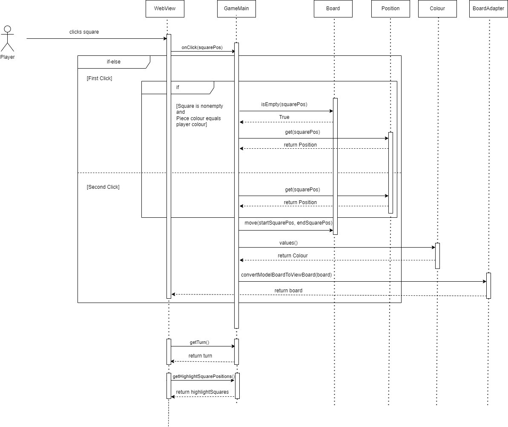
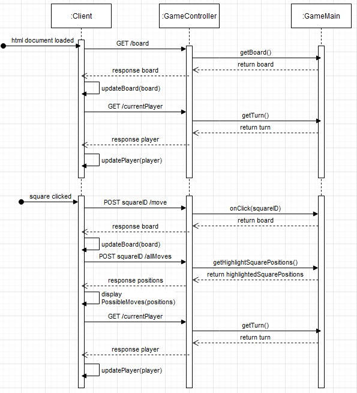

# Three Player Chess

## Overview
Three Player Chess is an innovative twist on the classic game of chess, designed to be played by three players simultaneously. This README provides detailed information about the backend, technologies used, model architecture, and testing procedures.

## Key Design Decisions
* The game is a springboot application
* Multi module gradle project comprising of backend and web app
* Web app is developed using html, css and javascript
* On a click input from the web app, backend sends all the required information
* A new piece "JESTER" - which moves similar to KNIGHT but swaps positions with the opponent
* A new piece "WALL" - moves similar to rook but can neither take opponent piece nor be taken down. 
* For every action in the web application, a post request is made. 

## Project Structure
The project consists of 2 different Modules:
1. webapp: This module contains the Spring web application
2. backend: This module contains the entire game logic for three player chess


## Model Architecture
### Backend Class Diagram


### Backend Sequence Diagram


### Web Sequence Diagram


## Testing
### Unit Testing
- **JUnit**: Used for unit tests to ensure individual components and functions work as expected.

### Integration Testing
- **Supertest**: For testing API endpoints.

### End-to-End Testing
- **Cypress**: Comprehensive end-to-end tests to simulate real user interactions and ensure the entire application works seamlessly.


## Installation
Clone the repository
```sh
git clone https://github.com/ShashankSinha98/Coding-Ninjas-Chess.git
  ```

Run the web application:
```sh
gradlew bootRun
  ```

## Deployment
The web application is available under https://threeplayerchess.onrender.com.

For the deployment there is a Dockerfile in the project directory.
This was used to create a Docker image and push it to DockerHub.
A web service was then created with Render (https://render.com/), which works with the DockerHub image.

## Contributors
- Nandhish Thathanur Rajappa
- Shashank Sinha
- Stefan Schulze